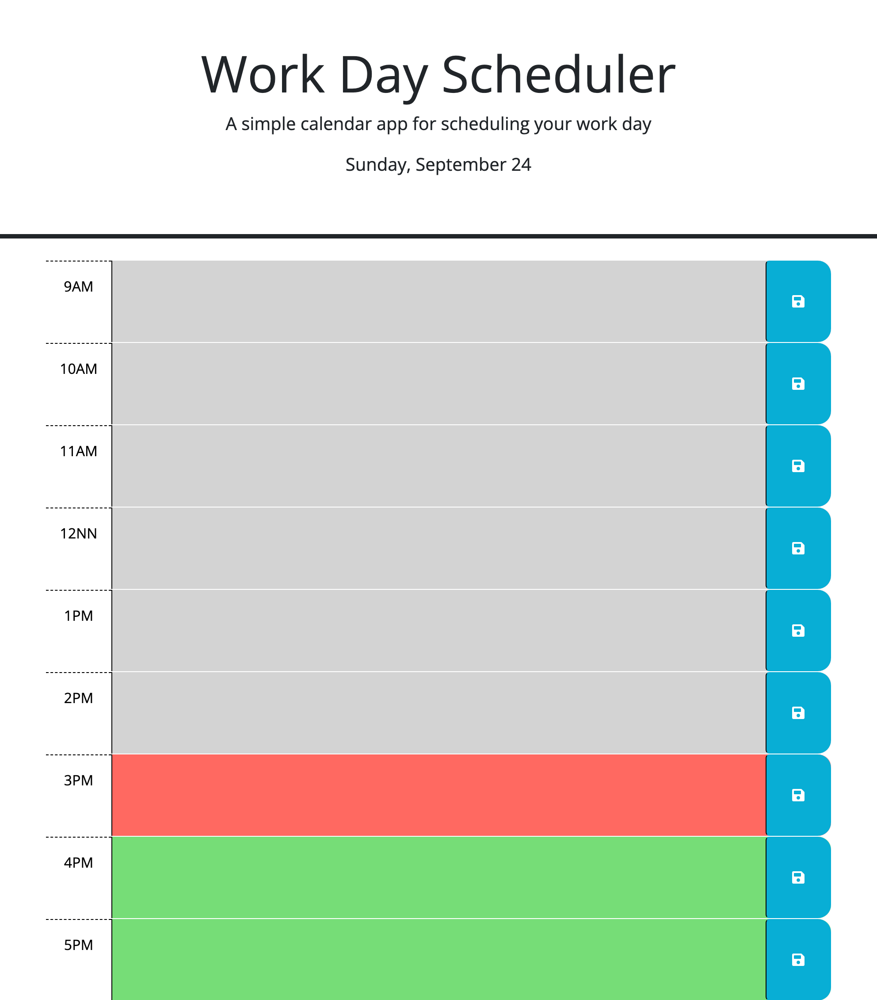

# Work Day Scheduler

## Description

This Work Day Scheduler was created for users who need their daily schedules organized based on a work day of 9AM-5PM.

## Installation

N/A

## Usage

The following image displays the scheduler:

On the header, the scheduler will display the day and date for today.

Each time block will be color coded according to past, present, and future time blocks which will be based on the current time.

You are able to input a description for each time block and have it saved even after refreshing the page which adds convenience and efficiency for the user.

Try it out here: https://tvserr.github.io/work-day-scheduler/

## Credits

N/A

## License

None